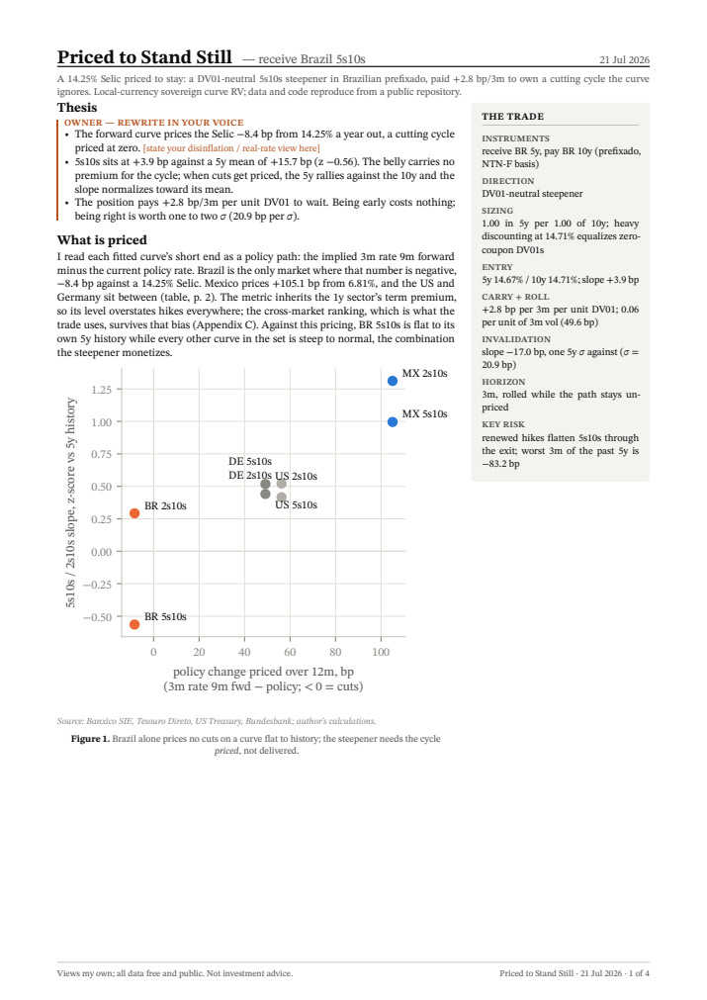
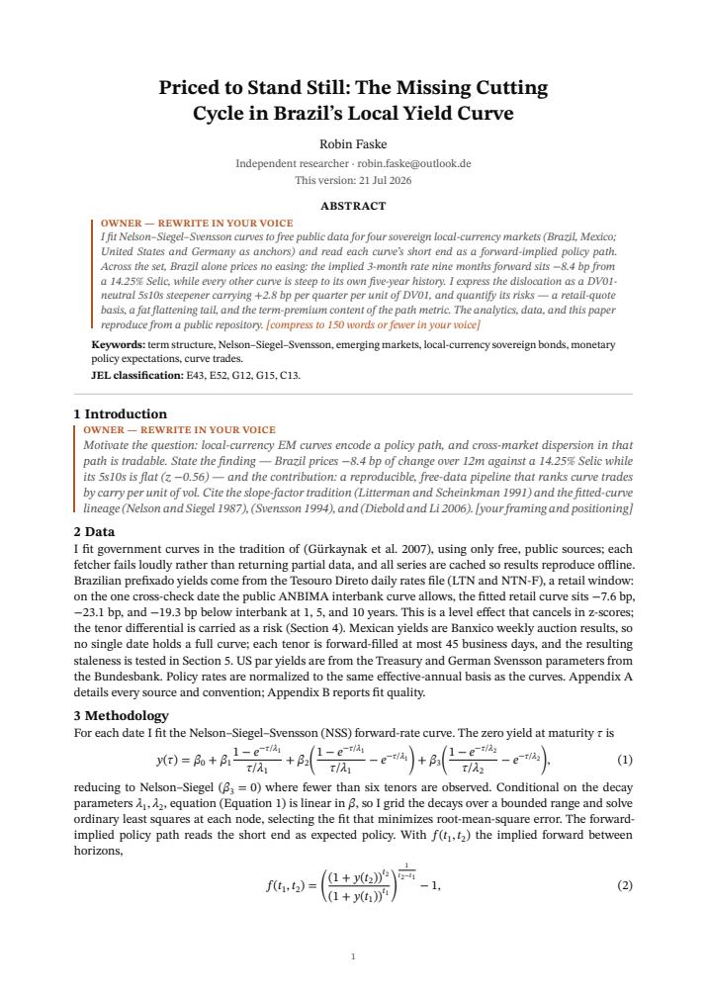

# EM sovereign curve RV — local cutting cycles, priced vs plausible

Where are local-currency cutting cycles mispriced along the curve? This repo
fits Nelson-Siegel(-Svensson) curves to free public data for Mexico and
Brazil (US and Germany as anchors), reads the short end as a forward-implied
policy path, scores 2s10s/5s10s slopes against their own 5-year history, and
prices DV01-neutral steepeners/flatteners on 3m static carry + rolldown —
sized by realized vol, so the ranking is carry per unit of risk, not raw
carry. Two documents build from one analytics layer with **no hand-typed
numbers**: a 2-page desk note and an SSRN-style working paper.

*Views are my own; all data is free and public (Banxico SIE, Tesouro
Nacional, BCB, US Treasury, FRED, Bundesbank). Nothing here reflects any
employer.*

## The two documents

| Desk note — [report/note.pdf](report/note.pdf) | Working paper — [paper/paper.pdf](paper/paper.pdf) |
|---|---|
| [](report/note.pdf) | [](paper/paper.pdf) |
| 2 pages + appendix; trade-first, number-dense. | 9-section term-structure paper with robustness. |

Both are built by one command; every figure, table, and inline statistic is
regenerated from the cache, and a provenance table maps each number to the
function that produced it (note Appendix D):

```bash
pip install -r requirements.txt
python scripts/build_report.py       # cache -> analytics -> includes -> both PDFs
```

## Run the analytics

```bash
python scripts/run_all.py            # offline: reads data/cache/, prints
                                     # sanity + trade tables, writes figures
python -m pytest                     # fit recovery, carry/roll, DV01, robustness
```

Refreshing data (`python scripts/run_all.py --refresh`) is the only step
needing network access and (for Mexico) a free API token — copy
`.env.example` to `.env`. Reproduction from the committed cache needs
nothing.

## Method in one paragraph

All yields are normalized to effective annual (per-country quoting bases —
Brazil's 252-business-day compounding, MX/US semiannual bond-equivalent — in
[DECISIONS.md](DECISIONS.md)). Where a central bank or agency publishes daily
Svensson parameters (DE) they are used directly; elsewhere curves are fit by
gridded-τ least squares with RMSE reported per fit. Carry + roll is 3m static
along today's fitted curve, funded at the policy rate, in bp per 3m per unit
DV01; trade vol is the realized vol of the fitted slope. "Policy change
priced over 12m" is the implied 3m rate 9m forward minus the policy rate (the
crude `2×(1y−policy)` proxy is kept for comparison). Every simplification is
stated in DECISIONS.md rather than hidden.

## Layout

```
src/fetchers.py     one fetcher per source, cache-first, fails loudly
src/curves.py       NS/NSS fits, beta time series, RMSE per fit
src/analytics.py    carry, rolldown, z-scores, forward-path metric, vol sizing
src/robustness.py   λ-sensitivity, rolling RMSE, sampling vol, z mean reversion
src/theme.py        shared STIX figure theme, vector-PDF export
src/plots.py        the three figures, one palette
scripts/run_all.py  cache -> fit -> analytics -> figures
scripts/build_report.py  analytics -> report/includes/ -> note.pdf + paper.pdf
report/note.typ     desk note (Typst)
paper/paper.typ     working paper (Typst) + refs.bib
tests/              curve recovery, carry math, DV01 neutrality, robustness
```

Fonts (STIX Two Text/Math) are committed under `assets/fonts/` so both
documents build hermetically.
