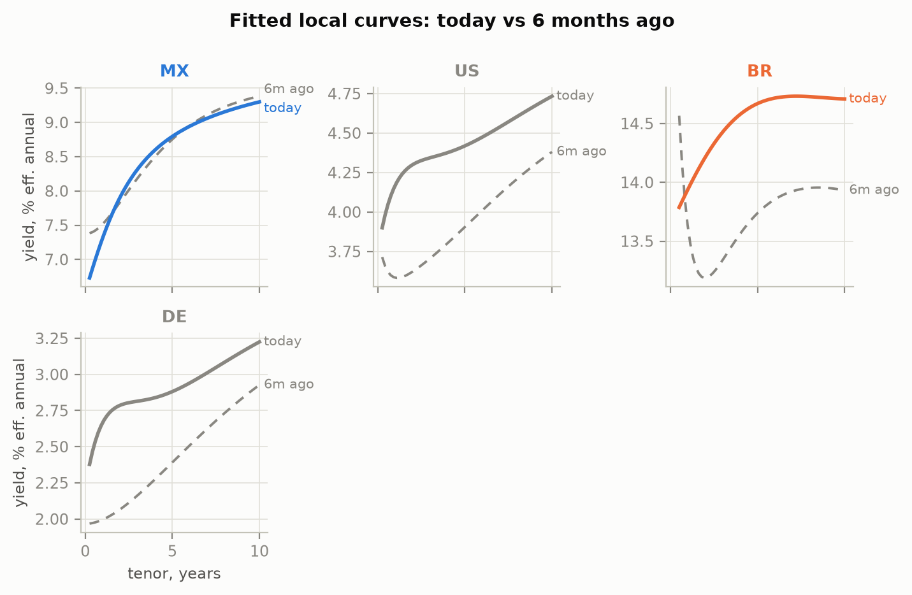
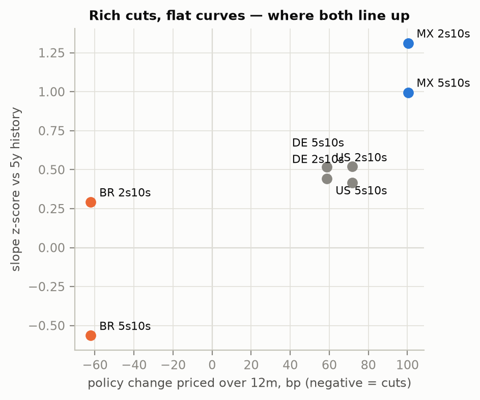
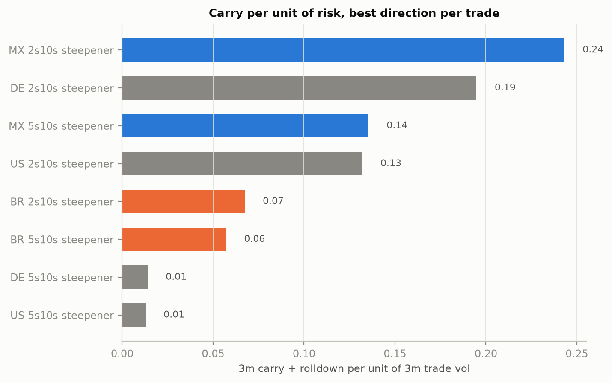

# EM sovereign curve RV — local cutting cycles, priced vs plausible

Where are local-currency cutting cycles mispriced along the curve? This repo
fits Nelson-Siegel(-Svensson) curves to free public data for Mexico and
Brazil (US and Germany as anchors), reads the short end as an implied policy
path, scores 2s10s/5s10s slopes against their own 5-year history, and prices
DV01-neutral steepeners/flatteners on 3m static carry + rolldown — sized by
realized vol, so the ranking chart is carry per unit of risk, not raw carry.
(Poland/Hungary/Turkey were candidates; PL/HU failed the free-data quality
gate and TR awaits an API key — the audit trail is in DECISIONS.md.)

*Views are my own; all data is free and public (Banxico SIE, Tesouro
Nacional, BCB, treasury.gov, FRED, Bundesbank). Nothing here reflects any
employer.*

## Charts

| Curves: today vs 6m ago | Z-score vs cuts priced | Carry per unit vol |
|---|---|---|
|  |  |  |

*(Regenerate any time with the run below — the committed cache makes it
fully offline-reproducible.)*

## Run it

```bash
pip install -r requirements.txt
python scripts/run_all.py            # offline: reads data/cache/, prints
                                     # sanity + trade tables, writes output/figs/
python -m pytest                     # fit recovery, carry/roll math, DV01 neutrality
```

Refreshing data (`python scripts/run_all.py --refresh`) is the only step
that needs network access and (for Mexico) a free API token — copy
`.env.example` to `.env`. Reproduction from the committed cache needs
nothing.

## Method in one paragraph

All yields are normalized to effective annual (per-country quoting bases —
Brazil's 252-business-day compounding, MX/US semiannual bond-equivalent —
are documented in [DECISIONS.md](DECISIONS.md)). Where the central bank or
ANBIMA publishes daily Svensson parameters (DE, BR) we use them directly;
elsewhere (MX, US) we fit by gridded-tau least squares and report RMSE in bp
per fit. Carry+roll is 3m static along today's fitted curve, funded at the
policy rate, quoted in bp per 3m per unit DV01; trade vol is the realized
vol of the fitted slope. Cuts priced over 12m reads the fitted 1y yield as
the average expected policy rate under a linear path. Every simplification
is stated in DECISIONS.md rather than hidden.

## Layout

```
src/fetchers.py    one fetcher per source, cache-first, fails loudly
src/curves.py      NS/NSS fits, beta time series, RMSE per fit
src/analytics.py   carry, rolldown, z-scores, cuts priced, vol sizing
src/plots.py       the three figures, one palette
scripts/run_all.py cache -> fit -> analytics -> figures
tests/             synthetic-curve recovery, carry math, DV01 neutrality
note/outline.md    skeleton of the 2-page note
```
